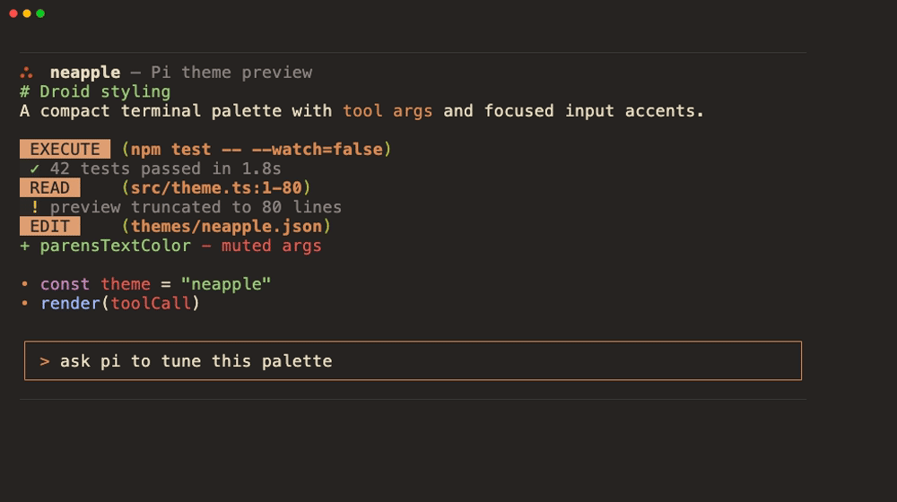
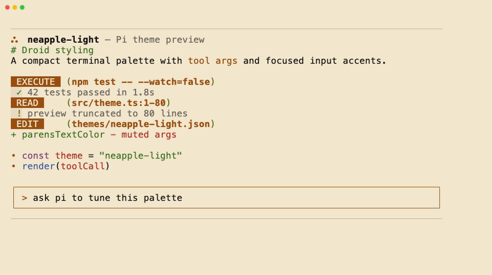
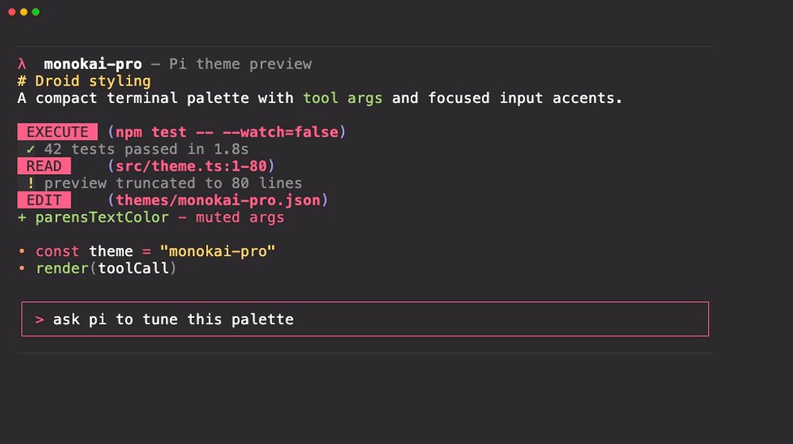
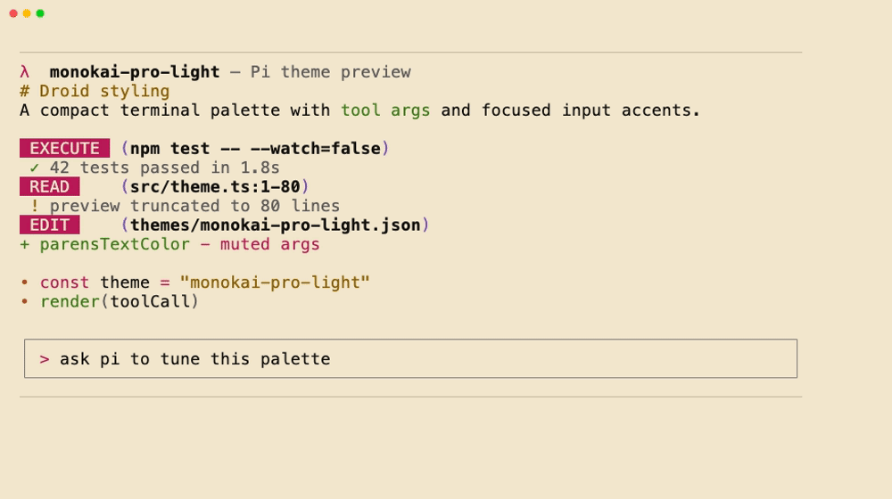
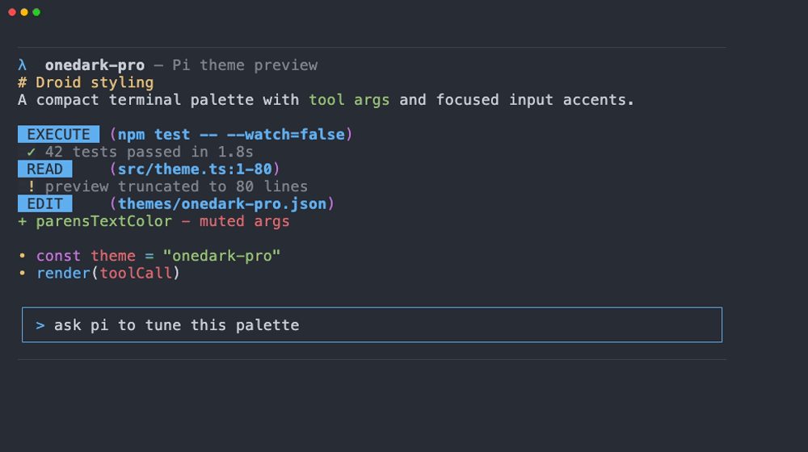
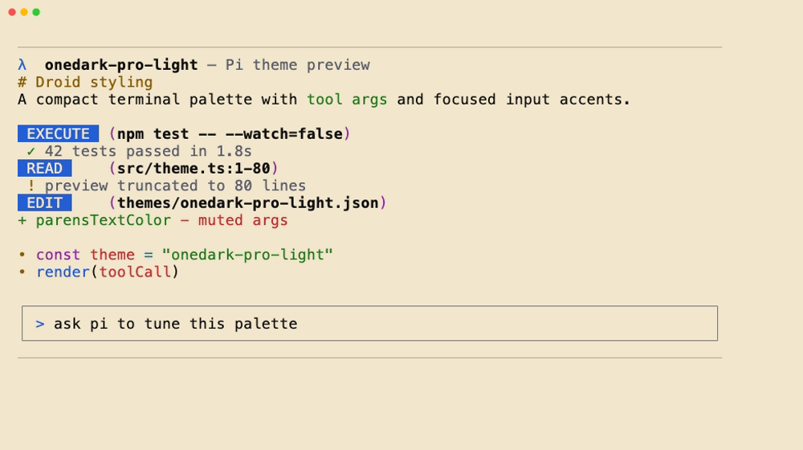
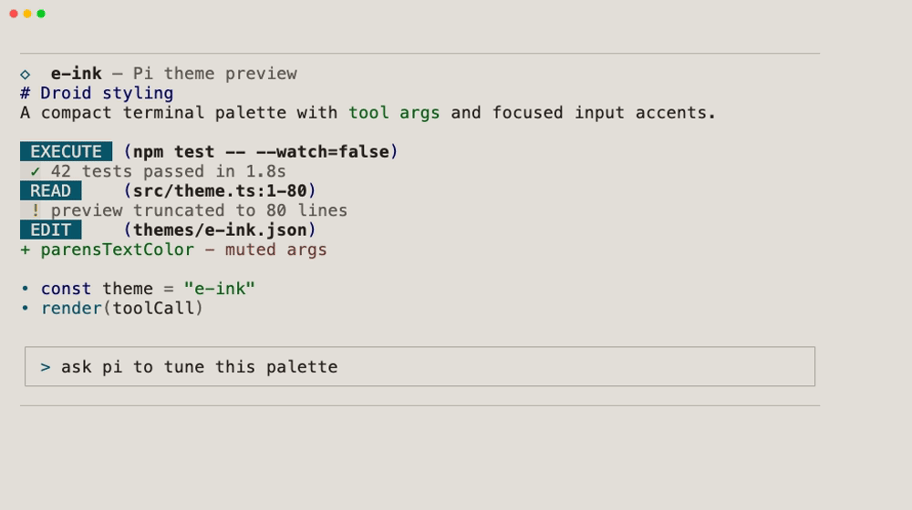
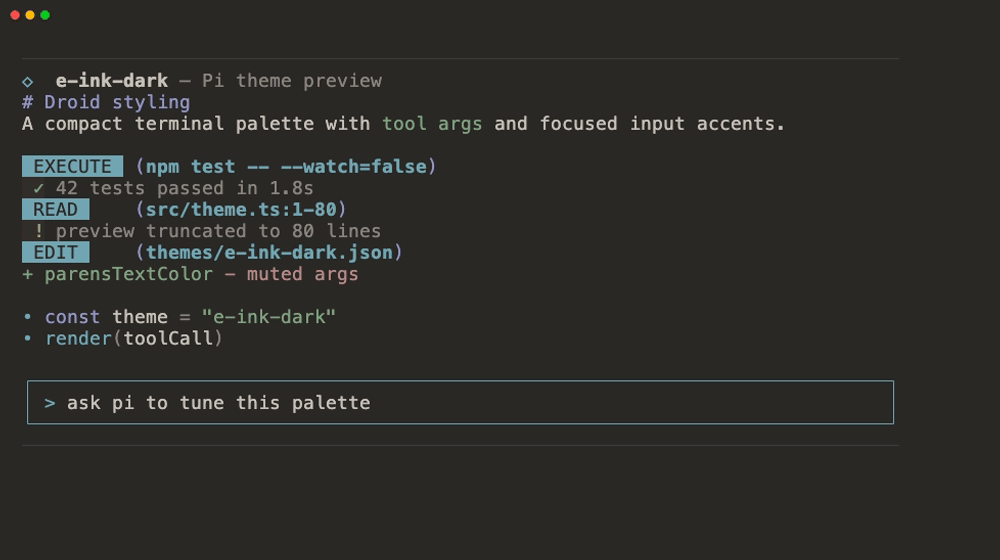
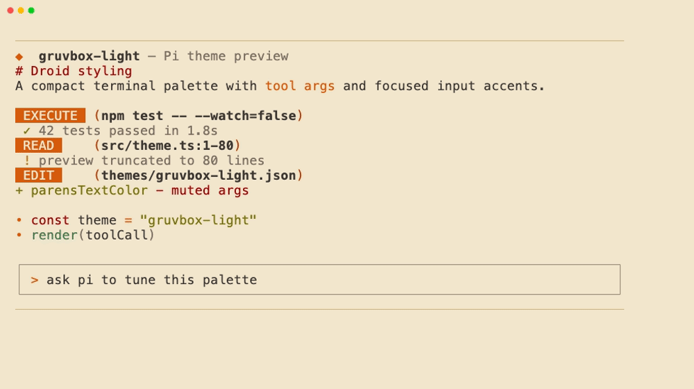
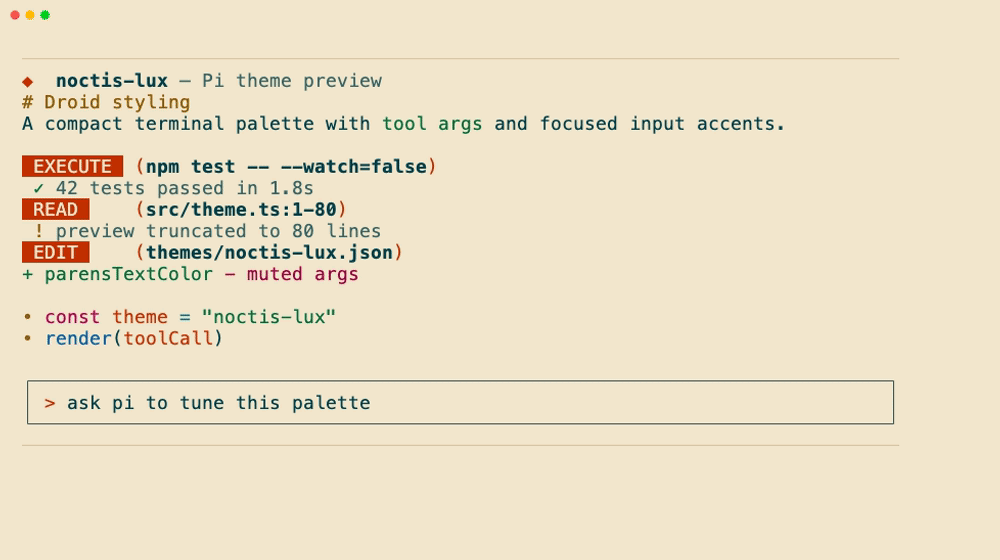

# pi-themes

Custom themes for Pi Coding Agent.

This theme pack is mostly vibe-driven and low-maintenance; use it if it looks good to you.

## Preview

These preview images are only rough color references. I was too lazy to capture real Pi sessions, so GPT generated them; they are not pixel-perfect and should be treated as approximate palette previews.

| Theme | Preview |
|---|---|
| `neapple` |  |
| `neapple-light` |  |
| `monokai-pro` |  |
| `monokai-pro-light` |  |
| `onedark-pro` |  |
| `onedark-pro-light` |  |
| `e-ink` |  |
| `e-ink-dark` |  |
| `gruvbox-light` |  |
| `noctis-lux` |  |

## Install

Pi discovers package themes from `themes/` directories or `pi.themes` entries in `package.json`.

Clone or install this package into a location loaded by Pi, then make sure the package exposes:

```json
{
  "pi": {
    "themes": ["./themes"]
  }
}
```

You can also point Pi at this package's theme directory explicitly:

```json
{
  "themes": ["/path/to/pi-themes/themes"]
}
```

## Use

Select a theme via `/settings`, or set it in `settings.json`:

```json
{
  "theme": "neapple"
}
```

Theme docs: https://github.com/badlogic/pi-mono/blob/main/packages/coding-agent/docs/themes.md

## Themes

`neapple`, `neapple-light`, `monokai-pro`, `monokai-pro-light`, `onedark-pro`, `onedark-darker`, `onedark-obsidian`, `onedark-pro-light`, `tokyo-dark`, `miasma`, `solarized-osaka`, `e-ink`, `e-ink-dark`, `gruvbox-light`, `noctis-lux`.

## License

MIT
